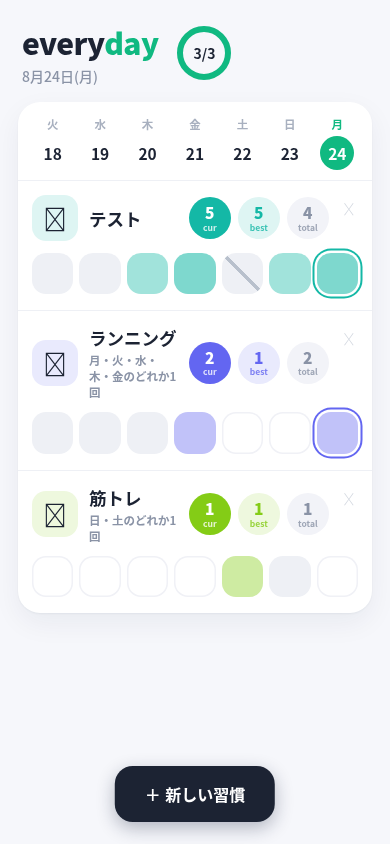

# everyday — self-hosted habit tracker

A minimal, everyday.app-inspired habit tracker that runs as a **single Node.js file** (zero npm dependencies, uses the built-in `node:sqlite`).



## Features

- 📱 **Mobile-first UI** — everyday.app-style card layout, big tappable cells
- 🎨 **Streak heatmap** — cells darken as consecutive days stack up (1 day = 40% → 5+ days = full color)
- ✂️ **Skip** — long-press (mobile) / right-click (desktop) to skip a day with a diagonal slash; the streak bridges over skipped days
- 📆 **Any-of-weekday habits** — e.g. "run on any weekday", "gym on either weekend day". Non-target days are shown faded and rejected by the API. The streak counts *periods* (one per maximal run of allowed weekdays), not calendar days.
- 🗓 **All-of-weekday habits** — e.g. "weekdays only": every selected day counts, non-selected days are auto-skipped (the streak bridges over them automatically).
- 📊 Streak badges (current / best / total) per habit + daily progress ring
- 📶 **PWA + offline** — installable (manifest + service worker), reads from cache when offline, and queues check-ins/skips in `localStorage` to flush when back online
- 🌓 **Dark / light theme** — toggle in the header (🌙/☀️), follows the system preference by default, persisted per device (`?theme=dark|light` also works)
- 🖥️ **Responsive** — 7-day grid on phones, up to 45 days on wide screens (cells scale up)
- 🌱 Archiving (soft delete) — history is never lost

## Requirements

- Node.js ≥ 22 (needs the built-in `node:sqlite`, stable since 22.5)

## Run

```bash
cp config.example.json config.json   # then edit port/token
node server.mjs
```

Open `http://127.0.0.1:8090/?key=<your-token>`.

> The key is stored in `localStorage` after the first visit, so the URL with `?key=` is only needed once. PWA assets (`sw.js`, `manifest.webmanifest`, icons) are served without auth; everything else requires the key (query param or `Authorization: Bearer`).

## API

- `GET /api/state` — full state: habits with days, skips, streak/longest/total
- `POST /api/toggle` — `{ habit_id, date? }` toggle a check-in
- `POST /api/skip` — `{ habit_id, date? }` toggle a skip (streak bridges over)
- `POST /api/habits` — `{ op: "create", name, emoji?, any_days?: number[], all_days?: number[] }` or `{ op: "delete", id }`
  - `any_days`: array of weekday numbers (0=Sun … 6=Sat) — one hit on any of these days counts
  - `all_days`: array of weekday numbers — every selected day counts; non-selected days are auto-skipped
  - both omitted/null → daily habit

## Deploy notes

- Listens on `127.0.0.1` only — put a reverse proxy (nginx/caddy) in front for TLS/remote access.
- `habits.db` (SQLite) is created next to `server.mjs` on first run.
- Data lives in two tables: `habits` (with `any_days` JSON) and `checkins` (`date`, `skip`).

## Agent skill

This repo ships an agent skill (`skill/habit-tracker/`) so an OpenClaw/Codex-style agent can operate the tracker for you (check in, report streaks, …). See `skill/habit-tracker/SKILL.md`.

## License

MIT
